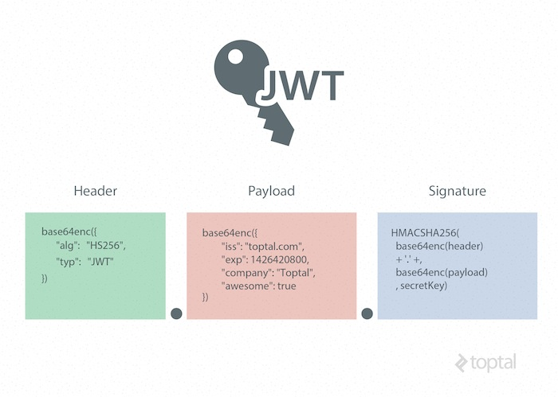

## JWT的组成

一个JWT实际上就是一个字符串，它由三部分组成，头部、载荷与签名。



### 头部（Header）
JWT 头部用于描述关于该JWT的最基本的信息，例如其类型以及签名所用的算法等。这也可以被表示成一个JSON对象。

```
{
"typ": "JWT",
"alg": "HS256"
}
```


### 载荷（Payload）

```
{ "iss": "Online JWT Builder", 
  "iat": 1416797419, 
  "exp": 1448333419, 
  "aud": "www.example.com", 
  "sub": "jrocket@example.com", 
  "GivenName": "Johnny", 
  "Surname": "Rocket", 
  "Email": "jrocket@example.com", 
  "Role": [ "Manager", "Project Administrator" ] 
}
```

iss: 该JWT的签发者，是否使用是可选的；  
sub: 该JWT所面向的用户，是否使用是可选的；  
aud: 接收该JWT的一方，是否使用是可选的；  
exp(expires): 什么时候过期，这里是一个Unix时间戳，是否使用是可选的；  
iat(issued at): 在什么时候签发的(UNIX时间)，是否使用是可选的；  
其他还有：  
nbf (Not Before)：如果当前时间在nbf里的时间之前，则Token不被接受；一般都会留一些余地，比如几分钟；，是否使用是可选的  


### 签名（Signature）
将上面的两个编码后的字符串都用句号.连接在一起（头部在前），拼接完的字符串用HS256算法进行加密


### 使用

```
....

```